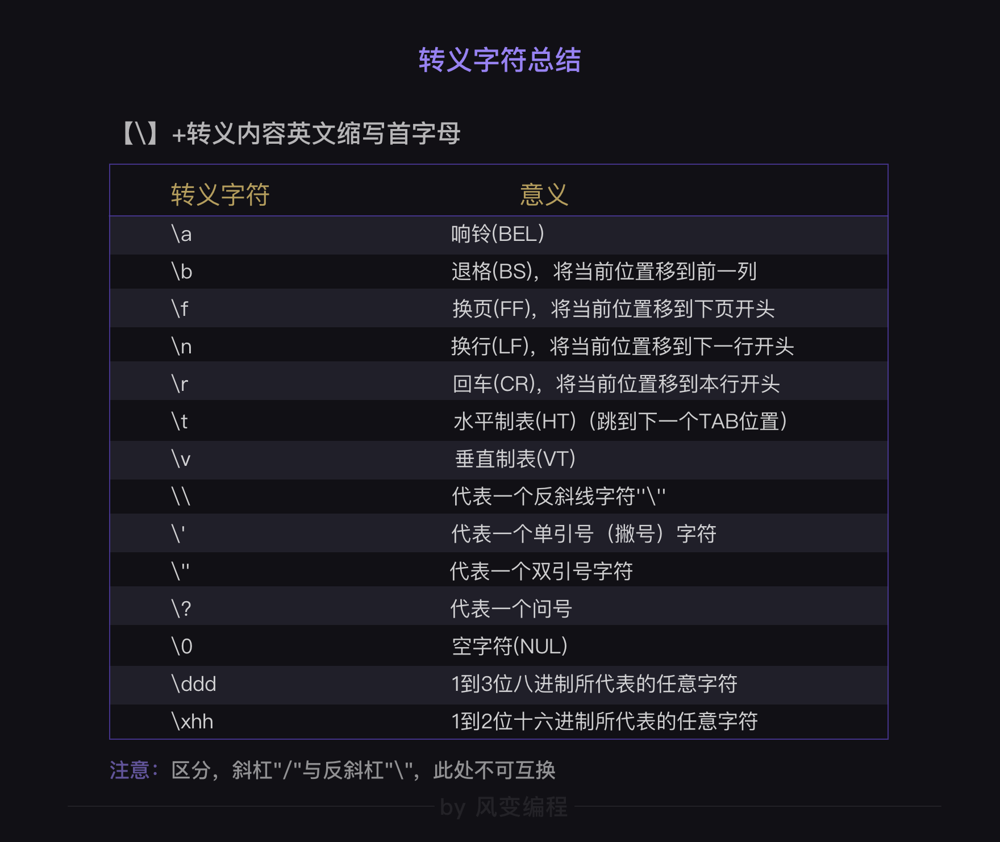

[frontend master Intro to python](https://frontendmasters.com/workshops/intro-to-python/)

老师: [Nina Zakharenko](https://twitter.com/nnja)

初始化一个[虚拟环境](https://www.learnpython.dev/01-introduction/02-requirements/)

### Creating a Virtual Environment and The Project Folder

```powershell
mkdir pyworkshop
cd pyworkshop
py -3 -m venv env
env\scripts\activate
```


python 中的 null 不叫 null，叫 `None`

f-string 格式化输出 string

```python
name = "lilei"
f"hello {name}" # hello lilei
```

还有一种像 c 语言一样的在控制台输出的 print()

python 中定义函数没有像 JavaScript 中的大括号，缩进来确定函数的域？最后函数结束的时候多一个换行

```python
def say_greeting(name, greeting="Hello"):
    print(f"{greeting}, {name}")
    
# 默认参数
def create_query(language="javascript", num_stars=50, sort="desc")
	return f"language: {language}, {num_stars} {sort}"

create_qurey(language="python") # 可以这样来指定参数
```

默认参数不要用引用类型，他们共用同一个内存的数据

可以让参数默认为 None，然后判断参数为 None 时再指定引用类型默认值

### `list` cheat sheet

| type               | `list`                                                       |
| :----------------- | :----------------------------------------------------------- |
| use                | Used for storing similar items, and in cases where items need to be added or removed. |
| creation           | `[]` or `list()` for empty list, or `[1, 2, 3]` for a list with items. |
| search methods     | `my_list.index(item)` or `item in my_list`                   |
| search speed       | Searching in an item in a large list is slow. Each item must be checked. |
| common methods     | `len(my_list)`, `append(item)` to add, `insert(index, item)` to insert in the middle, `pop()` to remove. |
| order preserved?   | Yes. Items can be accessed by index.                         |
| mutable?           | Yes                                                          |
| in-place sortable? | Yes. `my_list.sort()` or `my_list.reverse()` will sort the `list` in-place. |

### [Tuple](https://www.learnpython.dev/02-introduction-to-python/080-advanced-datatypes/30-tuples/)

tuple 是逗号来决定的，在一个 tuple 里取值可以像 JS 里解构赋值一样，但是不用括号，一个函数返回多个值用逗号隔开，返回的就是一个 tuple

### [Set](https://www.learnpython.dev/02-introduction-to-python/080-advanced-datatypes/50-sets/)

set 里面的值都是唯一值，而且它是 mutable 的，里面的值是没有顺序的， `hash([])` 会报 TypeError，所以`{[]}` 也是不行的

添加用 add 方法，删除用 discard 方法，如果删除的值是不存在的也不会报错，删除还可以用 remove 方法，但是如果不存在就报错

还可以用 update 方法来合并两个 set，如果 update 的是一个字符串，就会把字符串拆分成每个字符再合并

#### `set` operations cheat sheet

| method operation    | symbol operation | result                                                       |
| :------------------ | :--------------- | :----------------------------------------------------------- |
| `s.union(t)`        | `s | t`          | creates a new set with all the items **from both s and t**   |
| `s.intersection(t)` | `s & t`          | creates a new set containing *only* items that are **both in s and in t** |
| `s.difference(t)`   | `s ^ t`          | creates a new set with items **in s but not in t**           |

### Dictionaries

只有不可以改变的类型的值可以做为字典的 key，而且字典里面的键值对也是没有顺序的

## 布尔

字符串比较就是比较 ASCII 码，小写字母的 ASCII 码比大写字母的大


在print内部使用三引号'''（连续输入三个单引号）来实现自动换行



### 变量命名规范

1. 只能是一个词
2. 只能包含字母、数字和下划线
3. 不能以数字开头
4. 尽量描述包含的数据内容

### 数据类型

在Python的世界，最常用的数据类型有三种——字符串(str)、整数(int)和浮点数(float)，他们三者分别具有不同的属性：

字符串英文string，简写str，关于字符串，大家一定要记得：字符串类型必须有引号的辅助。

整数英文为integer，简写做int。代码世界的整数，和我们数学课本中定义的一样：是正整数、负整数和零的统称，是没有小数点的数字。


整数是不带小数点的数字，那么相对的，带小数点的数字，就是浮点数。

浮点数的英文名是float，与整数(int)和字符串(str)不同，浮点数没有简写

`print(0.55+0.3)` 的结果 `0.8500000000000001` 

这是因为，Python计算浮点数的方式与我们不一样。Python计算浮点数时，会先把0.55和0.3转化成二进制数【**注：二进制数由0和1表示，逢二进一**】

```python
#进制转换
0.55(十进制) = 0.1000110011001100110011001100110011001100110011001101(二进制)
0.3(十进制) = 0.0100110011001100110011001100110011001100110011001101(二进制)
```

### 字符拼接

只能将字符串与字符串拼接

type()函数，只需把查询的内容放在括号里就行，既简单又实用的函数，来帮助我们查询不确定数据的类型

### 数据转换

负责转换数据类型的函数一共有3种：str()、 int()和float()。

对于int()函数的使用，大家要注意一点：只有符合整数规范的字符串类数据，才能被int()强制转换。文字形式，比如中文、火星文或者标点符号，不可以被int()函数强制转换。小数形式的字符串，由于Python的语法规则，也不能使用int()函数强制转换。虽然浮点形式的字符串，不能使用int()函数。但浮点数是可以被int()函数强制转换的。

float()函数也可以将整数和字符串转换为浮点类型。但同时，如果括号里面的数据是字符串类型，那这个数据一定得是数字形式。

### 条件判断

```python
if stonenumber>=6:
    #条件：如果你拥有的宝石数量大于等于6个
    print('你拥有了毁灭宇宙的力量')
    #结果：显示‘你拥有了毁灭宇宙的力量’的结果
```

在条件判断代码中的冒号:后、下一行内容的前面，会空几个格

对于Python而言，冒号和缩进是一种语法。它会帮助Python区分代码之间的层次，理解条件执行的逻辑及先后顺序。

当我们去掉缩进时，if条件和print命令成为了两个不同的代码组，属于平行关系。会出现IndentationError: expected an indented block（缩进错误：期望一个缩进块）的报错

if条件下的内容会自动缩进，所以按照这个思路，else前也应该有缩进才对


### input()函数

1. 函数结果赋值给变量
2. 使用函数 input()，收集信息
3. 输出结果

数据类型

input()函数的输入值（搜集到的回答），永远会被强制性地转换为字符串类型。

强制转换：int() 等

